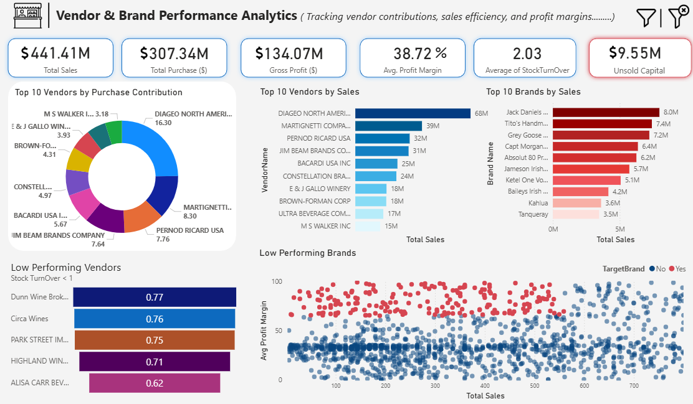
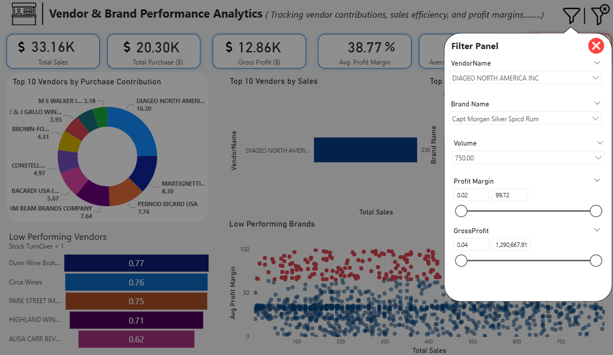
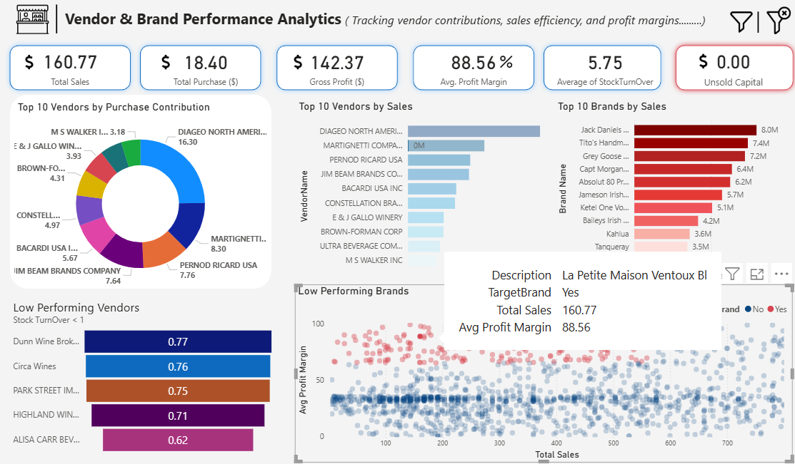

# 🧾 Vendor Performance Analysis  
**Tools:** SQL | Python | Power BI  
*A full-stack data analytics pipeline to evaluate and optimize vendor performance in the liquor retail/wholesale sector.*

---

## 🚀 Overview
This project provides a comprehensive view of vendor contributions across **sales**, **profitability**, **inventory**, and **operational efficiency**.

> 🎯 **Objective:** Maximize profitability, minimize unsold inventory, and improve vendor relationships through data-driven decision-making.

---

## 📌 Business Questions Answered
- Who are the top and underperforming vendors?
- Are purchases translating effectively into sales?
- Which vendors or brands are overpriced and not selling?
- Do high-profit vendors have low volume sales?
- Are we holding excessive unsold inventory?
- Is bulk purchasing reducing unit costs?

---

## 🛠️ Tools & Technologies Used
| Tool            | Purpose                                       |
|-----------------|-----------------------------------------------|
| **SQL Server**  | Central database and complex queries          |
| **Python**      | ETL, data wrangling (`pandas`, `SQLAlchemy`, `NumPy`) |
| **Jupyter**     | EDA, feature engineering, visualization       |
| **Power BI**    | Dashboard creation, KPI visuals               |
| **GitHub**      | Version control & collaboration               |

---

## 📁 Project Structure
```plaintext
├── Data/                              # Raw CSV files
├── logs/                              # ETL logs
├── data_ingestion.py                  # Python ETL script
├── get_vendors_summary.py             # Aggregation script
├── Exploratory Data Analysis.ipynb    # Python EDA notebook
├── Vendor Performance Analysis.ipynb  # Vendor-focused insights
├── Visualizing Insights.pbix          # Power BI dashboard file
└── README.md                          # This file
```
---

## 🔄 Workflow Summary
1. **Define KPIs** → Profit Margin, Unsold Inventory, Sales Ratio
2. **ETL** → Load CSVs into SQL via Python
3. **Logging** → Separate logs for ingestion, transformation & debugging
4. **Data Cleaning**→ Nulls, Duplicates, Standardization
5. **Feature Engineering** → Add calculated columns
6. **Data Aggregation** → Vendor-level summaries
7. **Analysis** → Visual EDA in Python
8. **Power BI** → Create dashboards (with auto-refresh)
9. **Business Reporting** → Strategic insights and recommendations 

---

## 📸 Power Bi Dashboard Snapshots
#### 🔷 Overall Performance Overview


#### 🔷 Filter Panel


#### 🔷 Analysing Low Performing brands


---

## 📊 Key Insights
- 🔴 **High Margin, Low Sales:** Low performers show 41.53% avg margin vs. top vendors’ 31.17%  
- 📦 **Unsold Stock:** $9.55M in idle inventory →  clearance strategy needed  
- 📉 **Over-Reliance:** Top 10 vendors = 65% of purchases → major risk  
- 💸 **Bulk Buying Advantage:** Up to 72% unit cost reduction  
- 📈 **Turnover ≠ Profit:** Weak correlation (-0.04) between stock turnover and gross profit

---

## 🧪 Hypothesis Test
**H₀ (Null)**: There is no difference in profit margin between top and low-performing vendors.

**H₁ (Alt)**: There is a significant difference.

✅ **Result**: We reject the null → performance significantly varies among vendors

---

## ✅ Recommendations
- 🏷️ Reprice high-margin, low-volume products to increase sales  
- 📦 Diversify vendors to reduce dependency risks  
- 📉 Optimize slow movers — clearance sales, reorder limits  
- 📊 Encourage bulk purchases with discount incentives  
- 📣 Improve marketing for poor-performing vendors  
- 🔄 Automate dashboard refresh for real-time insights  

---

**Outcome:** Delivered a robust, end-to-end solution for evaluating and improving vendor performance using real-world KPIs, statistical insights, and interactive dashboards.
